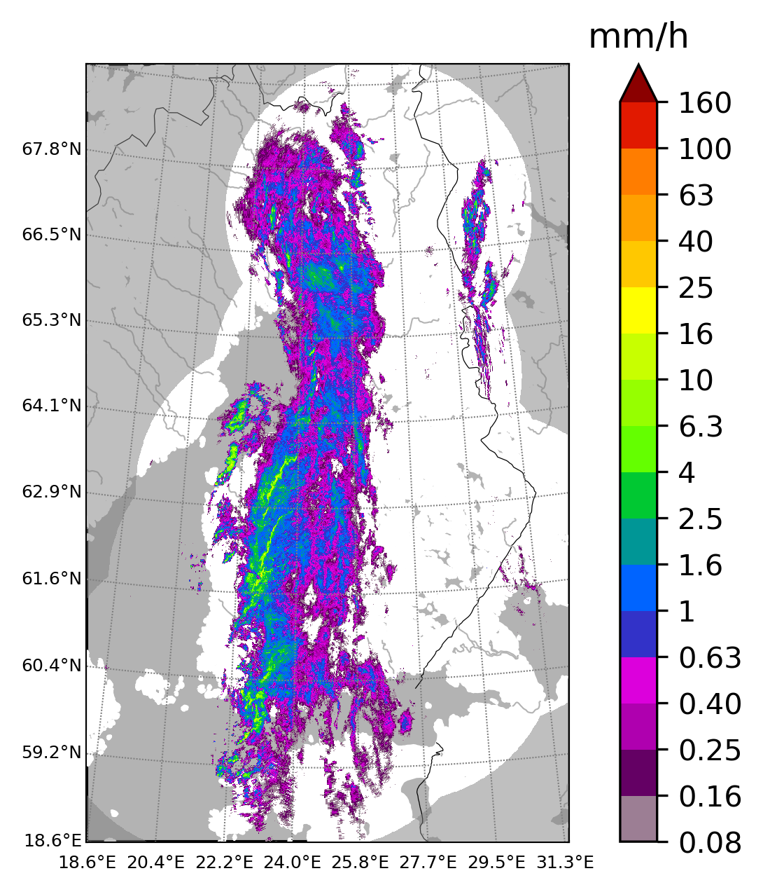
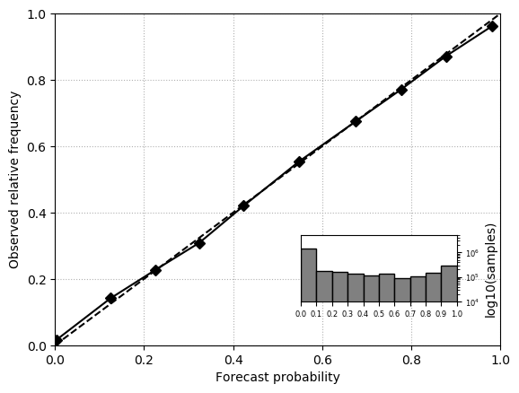
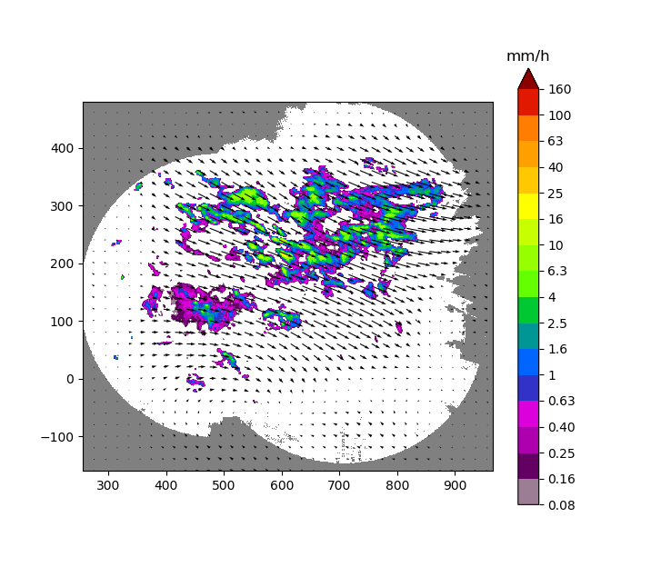
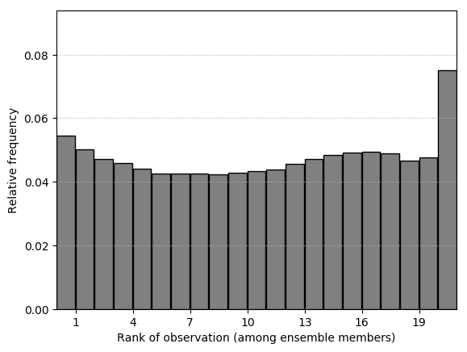

[logo]: https://avatars3.githubusercontent.com/u/40021569?s=200&v=4
![alt text][logo]

The pySTEPS initiative  is a community that develops and maintains an easy to use, modular, free and open source python framework for short-term ensemble prediction systems.

The focus is on **probabilistic nowcasting of radar precipitation fields**, but pySTEPS is designed to allow a wider range of uses.

## (25.03.2109) New documentation page on Read the Docs

In preparation of the V1.0 release, we have moved all our documentation to Read the Docs at the following link:

(https://pysteps.readthedocs.io)

Note that the [old documentation](https://pysteps.github.io/pysteps/refmanual/) for V0.2 is currently still available.

## Download pysteps 0.2

The most recent release of pysteps is available [here](https://github.com/pySTEPS/pysteps/releases).

Change log for pysteps 0.2:

-    Bug fixes.
-    Performance and syntax improvements.
-    Improve documentation to several modules and methods.
-    Add the Variational Echo Tracking (VET) method from MAPLE to the motion module.
-    Replace the config module with a JSON pystepsrc configuration file.
-    More efficient computation of the FFT in the cascade decomposition and noise generation by using the real FFT instead of the complex FFT, i.e. rfft2/irfft2 instead of fft2/ifft2.
-    More sensible naming of several main modules: optflow -> motion, advection -> extrapolation and postproc -> postprocessing.
-    New utility methods to clip the domain by geographical coordinates.
-    New data transformation methods: normal quantile, square-root and logarithmic transformations.
-    New importer for MeteoSwiss' metranet data format.
-    New "shift and scale" post-processing method.
-    Implement the S-PROG method with probability matching.
-    New intensity-scale verification method.
-    New visualization methods: cartopy backend, exceedance probabilities and plotting motion fields on a map.
-    Support for Swiss projection when using cartopy.
-    New interface module for different FFT methods and allow the user to choose the method.
-    Fix incorrect separation into components when using the bps method for adding perturbations to the advection field.
-    Two different methods for adjusting the temporal autocorrelation coefficients in order to guarantee stationarity of the resulting AR(2) models.
-    Modify the STEPS method to have the same number of positional arguments as the other methods in the nowcasts module and reorganize the keyword arguments.
-    Move the deterministic S-PROG mask computation outside the stochastic part of the STEPS method to avoid repeated computations.

## pysteps@UrbanRain2018

We are hosting a pysteps demo during the next [UrbanRain](http://www.urbanrain.ethz.ch/) conference in Pontresina (5-7 December 2018).

December 7, 14:00-15:00:
Topical Workshop 2: **Discover pysteps - the ensemble precipitation nowcasting library (demo session)**

This short session will present how to install, configure and run the code. The goal is to provide an overview of some of the features in pysteps and demonstrate its potential for hydrological applications. This will be a demo session, participants are not required to bring their laptops. 

## ERAD2018 short-course

Our first workshop using *pysteps* took place during ERAD2018 in Ede-Wageningen, NL, on 1 July 2018. With over 30 participants, this was a very successful workshop! We would like to thank all the participants for their enthusiasm and commitment! 

The short-course description and material are available on the [ERAD2018 website](https://www.erad2018.nl/short-courses/) (search for short-course 4: *Radar-based Ensemble Precipitation Nowcasting*).

## Quick-start guide
It is very easy to start using *pysteps*! You simply need to install the dependencies, download the latest *pysteps* version and install it.

Please refer to the [README document](https://github.com/pySTEPS/pysteps/blob/master/README.rst) in our main github repository for the installation instructions.

## Documentation

The documentation is available at this [link](https://pysteps.readthedocs.io).

## Gallery

*This FMI radar composite was imported and visualized with pysteps.*

*The reliability diagram for 0.1 mm/h threshold and a +60 minute ensemble nowcast with 20 members computed for the above FMI example.*

*The motion field estimated on a sequence of MeteoSwiss radar composites using DARTS.*

*The rank histogram of a 20-member nowcast at +60 minutes for the above MeteoSwiss event.*
