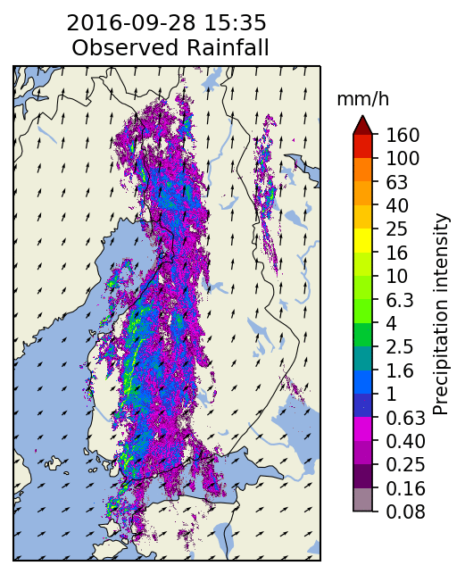
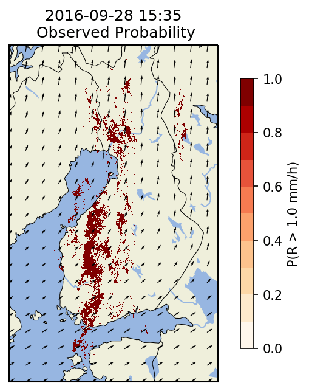

[logo]: https://avatars3.githubusercontent.com/u/40021569?s=200&v=4
![alt text][logo]

The pySTEPS initiative  is a community that develops and maintains an easy to use, modular, free and open-source **python framework for short-term ensemble prediction systems**.

The focus is on **probabilistic nowcasting of radar precipitation fields**, but pySTEPS is designed to allow a wider range of uses.

You can find the pysteps package on github.com: [https://github.com/pySTEPS/pysteps](https://github.com/pySTEPS/pysteps). Also checkout this [overview poster](https://www.researchgate.net/publication/332781022_pysteps_-_a_Community-Driven_Open-Source_Library_for_Precipitation_Nowcasting).

## Documentation

The pysteps documentation is available on Read the Docs

[https://pysteps.readthedocs.io](https://pysteps.readthedocs.io)

This also includes a [gallery of tutorials](https://pysteps.readthedocs.io/en/latest/auto_examples/index.html) and the [reference guide](https://pysteps.readthedocs.io/en/latest/pysteps_reference/index.html) for all modules and functions available in pysteps.

## Quick-start guide

The easiest way to install pysteps is through [conda](https://anaconda.org/conda-forge/pysteps). To install the pysteps package in an existing conda environment:

`conda install -c conda-forge pysteps`

Please refer to the pysteps [installation guide](https://pysteps.readthedocs.io/en/latest/user_guide/install_pysteps.html) for more detailed installation instructions.

## Get in touch

We encourage you to open [Issues](https://github.com/pySTEPS/pysteps/issues) via our [GitHub page](https://github.com/pySTEPS/pysteps). Alternatively, get in touch with the pysteps community on our [pysteps slack](https://pysteps.slack.com/). To get access to it, you first need to subscripbe using the following automatic [invitation page](https://pysteps-slackin.herokuapp.com/). This page can sometimes take a while to load so please be patient.

## ERAD2020 short-course

A second edition of our nowcasting workshop will take place at [ERAD2020](https://www.erad2020.ch/) in Locarno, Switzerland, on Aug 30th! Registration are already open, book your place and find more info [here](https://www.erad2020.ch/short-courses-1).

**Important update:** The 11th ERAD is postponed to 2022, see the official communication from the organizers [here](https://www.erad2020.ch/). The pysteps short course is consequently cancelled.

## ERAD2018 short-course

Our first workshop using *pysteps* took place during ERAD2018 in Ede-Wageningen, NL, on 1 July 2018. With over 30 participants, this was a very successful workshop! We would like to thank all the participants for their enthusiasm and commitment!

The short-course description and training material are available on the [ERAD2018 website](https://www.erad2018.nl/short-courses/) (search for short-course 4: *Radar-based Ensemble Precipitation Nowcasting*).

## Gallery

*One stochastic ensemble member produced by pysteps starting from the radar composite image from the Finnish Meteorological Institute (FMI).*

*Probability to exceed 1.0 mm/h derived from a 20-member ensemble nowcast for the above FMI example.*

*The reliability diagram for 0.1 mm/h threshold and a +60 minute ensemble nowcast with 20 members computed for the above FMI example.*

## Machine learning vs pysteps

How to correctly compare the accuracy of machine learning against pysteps?  
The two most important questions to ask are:
1. Do you only want to minimize prediction errors? In such case, you will get a deterministic nowcast similar to an *ensemble mean*, whose smoothing increases with forecast lead time.
2. Do you also want to represent the prediction uncertainty? In such case you will get a probabilistic nowcast, for example derived from an ensemble nowcast (several ensemble members).

In weather forecasting (and nowcasting) we want to achieve both goals because it is impossible to predict the evolution of a chaotic system with 100% accuracy.  

Both machine learning and pysteps offer methods to produce deterministic and probabilistic nowcasts.  
**It is very important to compare apples to apples!**

1. __*Deterministic machine learning vs pysteps*__

All deterministic machine learning algorithms that minimize a (variation) of mean squared error (MSE) will produce a smooth ensemble mean nowcast (lower variance). 
The same holds for convolutional and/or deep architectures.

Therefore, you should never use a variance-preserving radar extrapolation as reference for comparison (e.g. from the module pysteps.nowcasts.extrapolation).  
Instead, **deterministic machine learning predictions should be compared to the pysteps ensemble mean!**

A pysteps ensemble mean can be generated using the modules pysteps.nowcasts.sprog, pysteps.nowcasts.sseps, or pysteps.nowcasts.anvil. 
Another possibility, but more computationally demanding, is to average many ensemble members generated by the modules pysteps.nowcasts.steps or pysteps.nowcasts.sseps. 
Still, even by using the pysteps ensemble mean, it is not given that its variance will be the same as the one of machine learning predictions. 
Error normalization can be used to solve this issue.

A good deterministic comparison of (deep, convolutional) machine learning and pysteps nowcasts is given in Franch et al. (2020).

2. __*Probabilistic machine learning vs pysteps*__

Probabilistic machine learning regression methods can be roughly categorized into:
<ol type="a">
  <li>Quantile methods, such as quantile random forests and neural networks.</li>
  <li>Generative methods, such as generative adversarial neural networks (GANNs) and variational auto-encoders (VAEs).</li>
</ol>

a. *Quantile machine learning vs pysteps*  
Such probabilistic predictions are interesting, but can only estimate the probability of exceedance at a given point (see e.g. Foresti et al., 2019).

To estimate areal exceedance probabilities, for example above catchments, or to propagate the nowcast uncertainty into hydrological models, the full ensemble still needs to be generated, e.g. with generative machine learning models (see point 2.b).

b. *Generative machine learning vs pysteps*  
Generative machine learning methods are alike the pysteps ensemble members.
Both should display similar spatio-temporal correlations and dispersion around the ensemble mean.  
Adequate probabilistic forecast verification tools are: Fourier spectra in space and time, reliability diagrams, rank histograms, spread-error relationships, continuous ranked probability scores (CRPS), etc.

A proper probabilistic verification of generative machine learning models against pysteps would be an interesting research direction.

## Reference publications

Foresti, L., I. V. Sideris, D. Nerini, L. Beusch, and U. Germann, 2019: 
Using a 10-Year Radar Archive for Nowcasting Precipitation Growth and Decay: 
A Probabilistic Machine Learning Approach. *Wea. Forecasting*, **34**, 1547–1569.
[https://doi.org/10.1175/WAF-D-18-0206.1](https://journals.ametsoc.org/waf/article/34/5/1547/344718/Using-a-10-Year-Radar-Archive-for-Nowcasting)

Franch, G., D. Nerini, M. Pendesini, L. Coviello, G. Jurman, C. Furlanello, 2020:
Precipitation Nowcasting with Orographic Enhanced Stacked Generalization: 
Improving Deep Learning Predictions on Extreme Events. *Atmosphere*, **11,267**. 
[https://doi.org/10.3390/atmos11030267](https://www.mdpi.com/2073-4433/11/3/267).

Pulkkinen, S., D. Nerini, A. Perez Hortal, C. Velasco-Forero, U. Germann,
A. Seed, and L. Foresti, 2019:  Pysteps:  an open-source Python library for
probabilistic precipitation nowcasting (v1.0). *Geosci. Model Dev.*, **12 (10)**,
4185–4219. [doi:10.5194/gmd-12-4185-2019](https://doi.org/10.5194/gmd-12-4185-2019).

Pulkkinen, S., D. Nerini, A. Perez Hortal, C. Velasco-Forero, U. Germann, A. Seed, and
L. Foresti, 2019: pysteps - a Community-Driven Open-Source Library for
Precipitation Nowcasting. *Poster presented at the 3rd European Nowcasting
Conference, Madrid, ES*. [doi: 10.13140/RG.2.2.31368.67840](https://doi.org/10.13140/RG.2.2.31368.67840).

## Main partners
<pre style="background-color: white;">    </pre>

<pre style="background-color: white;">    </pre>

<pre style="background-color: white;"> </pre>
